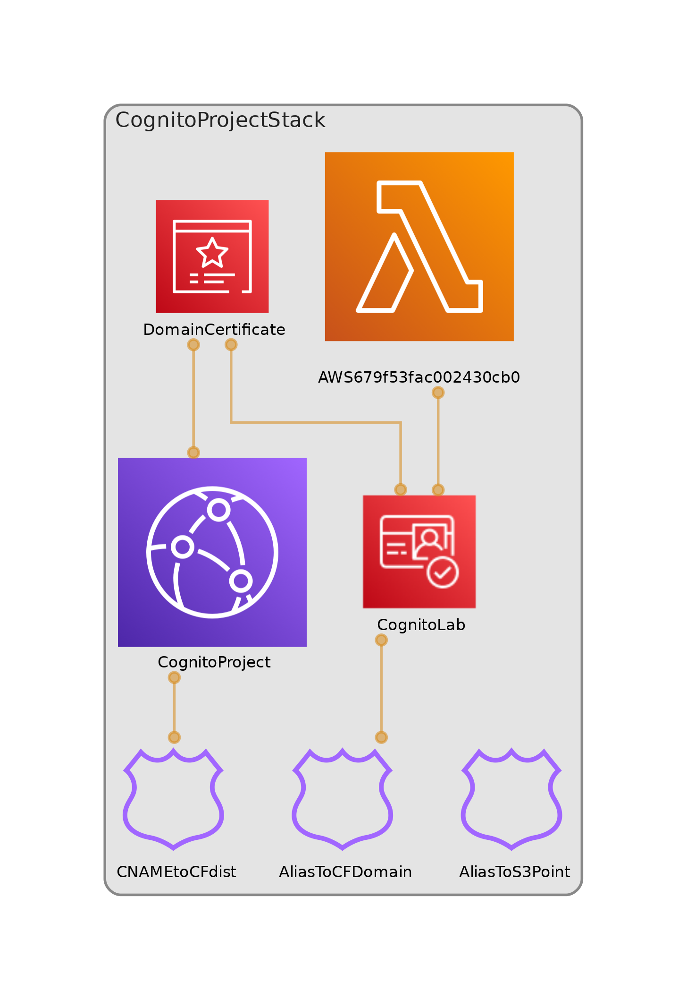

# Cognito Authentication

A serverless authentication system using AWS Cognito with a custom domain, integrated with Route 53, ACM, S3, and CloudFront for secure user sign-up, sign-in, and profile management.

[](https://www.python.org)
[](https://aws.amazon.com/cdk/)

## Overview

This project sets up a Cognito User Pool with an associated app client and a custom domain for secure user authentication. It uses AWS services including Route 53, AWS Certificate Manager (ACM), S3, and CloudFront to enable HTTPS communication and host frontend content. Users can sign up, sign in, and access their profiles via a custom domain (`auth.<your_domain_name>`).



## Table of Contents
- [Features](#features)
- [Architecture](#architecture)
- [Prerequisites](#prerequisites)
- [Installation](#installation)
- [Usage](#usage)
- [Outputs](#outputs)
- [Contributing](#contributing)
- [License](#license)
- [Contact](#contact)

## Features
- **Secure Authentication**: Cognito User Pool with self-sign-up, email verification, and OAuth authorization code grant flow.
- **Custom Domain**: Configured with Route 53 and ACM for secure HTTPS access.
- **Scalable Hosting**: S3 buckets for frontend content, served via CloudFront with HTTP-to-HTTPS redirection.
- **DNS Management**: Route 53 records for root and `www` subdomains pointing to CloudFront.
- **CDK Deployment**: Infrastructure defined and deployed using AWS Cloud Development Kit (CDK).

## Architecture

The `CognitoProjectStack` creates the following resources:

### Cognito User Pool
- **User Pool**: Named `CognitoLab`, supports self-sign-up and automatic email verification.
- **App Client**: `CognitoLabApp` with OAuth settings for authorization code grant flow.
- **Callback/Logout URLs**: Configured to `https://www.<your_domain_name>` for sign-in and sign-out redirection.

### Custom Domain
- **ACM Certificate**: Created for `*.<your_domain_name>` to secure communication.
- **Cognito Domain**: Associated with `auth.<your_domain_name>` for authentication endpoints.

### S3 Buckets
- Two buckets serve as CloudFront origins:
  - One for the root domain (`<your_domain_name>`).
  - One for the `www` subdomain (`www.<your_domain_name>`).

### CloudFront Distribution
- Configured to redirect HTTP to HTTPS.
- Uses the ACM certificate for secure communication.
- Default behavior points to the `www` subdomain S3 bucket.

### Route 53 Records
- **A Record**: Maps the root domain (`<your_domain_name>`) to the CloudFront distribution.
- **CNAME Record**: Maps the `www` subdomain to the CloudFront distribution.

## Prerequisites
- **AWS Account**: With permissions to create Cognito User Pools, S3 buckets, CloudFront distributions, Route 53 records, and ACM certificates.
- **AWS CLI**: Installed and configured with appropriate credentials.
- **Node.js**: Required for AWS CDK (version 14 or higher recommended).
- **Python**: Version 3.8 or higher.
- **AWS CDK**: Install via `npm install -g aws-cdk`.

## Installation
1. Clone the repository:
   ```bash
   git clone https://github.com/username/repo.git
   cd cognito-authentication
   ```
2. Create and activate a virtual environment:
   - **MacOS/Linux**:
     ```bash
     python3 -m venv .venv
     source .venv/bin/activate
     ```
   - **Windows**:
     ```bash
     python -m venv .venv
     .venv\Scripts\activate.bat
     ```
3. Install dependencies:
   ```bash
   pip install -r requirements.txt
   ```
4. Configure AWS CLI credentials:
   ```bash
   aws configure
   ```
5. Bootstrap the AWS account for CDK:
   ```bash
   cdk bootstrap
   ```
6. Update the `exports.sh` file with required values (e.g., domain name) and run it:
   ```bash
   . ./exports.sh
   ```
7. Synthesize the CloudFormation template:
   ```bash
   cdk ls
   ```
8. Deploy the stack and save outputs:
   ```bash
   cdk deploy CognitoProjectStack --require-approval=never --outputs-file ./cdk-outputs.json
   ```
9. Deploy the frontend code:
   ```bash
   ./build.sh
   ```

## Usage
1. Navigate to the custom domain: `cmcloudlab<id>.info` (replace `<id>` with your lab-specific identifier).
2. Sign up or sign in via the Cognito-hosted UI at `auth.<your_domain_name>`.
3. After authentication, users are redirected to `https://www.<your_domain_name>` for profile access or other frontend content.
4. Use the outputs in `cdk-outputs.json` to integrate with other applications or scripts.

## Outputs
After deployment, the following outputs are provided in `cdk-outputs.json`:
- **userPoolId**: ID of the Cognito User Pool.
- **userPoolWebClientId**: ID of the Cognito app client.
- **AuthDomain**: Custom domain for Cognito authentication (`auth.<your_domain_name>`).
- **RedirectSignIn**: URL for redirect after sign-in.
- **RedirectSignOut**: URL for redirect after sign-out.
- **DestinationS3**: Name of the S3 bucket for the `www` subdomain.
- **cognitocfdomainalias**: CloudFront domain alias for the custom domain.